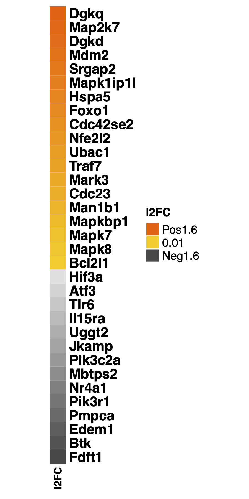
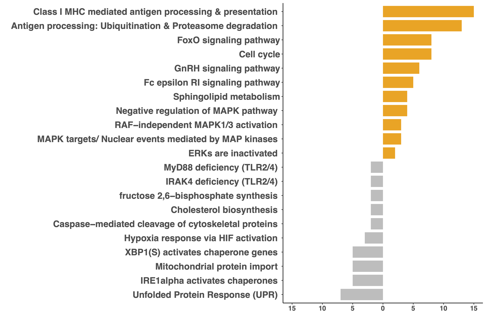

# Harrison_Nus_2024
# Marginal Zone B cells produce ‘natural’ atheroprotective IgM antibodies in a T cell dependent manner
James Harrison<sup>1</sup>, Steve Newland, PhD<sup>1</sup>, Wei jiang, PhD<sup>1</sup>, Despina Giakomidi, PhD<sup>1</sup>,
Xiaohui Zhao, PhD<sup>1</sup>, Marc Clement, PhD<sup>1,2</sup>, Leanne Masters<sup>1</sup>, Andrej Corovic, MD<sup>1</sup>, Xian Zhang,PhD<sup>3</sup>, Fabrizio Drago, PhD<sup>4</sup>, Marcella Ma, PhD<sup>5</sup>, Maria Ozsvar Kozma<sup>6</sup>, LFroher Yasin<sup>1</sup>,Yuta Saady<sup>1</sup>, Hema Kothari, PhD<sup>4</sup>, Tian X Zhao, MD, PhD<sup>1</sup>, Guo-Ping Shi, PhD<sup>3</sup>, Coleen McNamara, MD,PhD<sup>4</sup>,Christoph Binder, PhD<sup>6</sup>, Andrew P Sage, PhD<sup>1</sup>, Jason M Tarkin, MD, PhD<sup>1</sup>, Ziad Mallat, MD, PhD<sup>1,7</sup>, Meritxell Nus, PhD<sup>1\*</sup>

Journal xxx,  [](https://doi.org/***) <br>


<sup>1</sup> Heart and Lung Research Institute (HLRI), Cardiovascular Division, Dept. of Medicine, University of Cambridge, United Kingdom
<sup>2</sup> Laboratory for Vascular Translational Sciences (LVTS) Université de Paris, INSERM U1148, Paris, France
<sup>3</sup> Department of Medicine, Brigham and Woman’s Hospital, Harvard Medical School, Boston, MA, US
<sup>4</sup> Division of Cardiovascular Medicine, Department of Medicine, University of Virginia, Charlottesville, Virginia
<sup>5</sup> Wellcome-MRC Institute of Metabolic Science and Medical Research Council Metabolic Diseases Unit, University of Cambridge, United Kingdom
<sup>6</sup> Department of Laboratory Medicine, Medical University of Vienna, Vienna, Austria
<sup>7</sup> Universite de Paris, PARCC Inserm U970, Paris, France


*Address for correspondance: Dr Meritxell Nus, VPD Heart and Lung Research Institute (HLRI), Cardiovascular Division, Dept. of Medicine, University of Cambridge, Papworth Road, Cambridge Biomedical Campus, Cambridge CB2 0BB, United Kingdom. Email: mn421@cam.ac.uk


Code Release for this github: [](https://zenodo.org/badge/latestdoi/***)

## Abstract
**Aims:** The adaptive immune response plays an important role in atherosclerosis. In response to a high fat/high cholesterol (HF/HC) diet, marginal zone B (MZB) cells activate an atheroprotective programme by regulating the differentiation and accumulation of “poorly differentiated” T follicular helper (Tfh) cells. On the other hand, Tfh cells activate the germinal center response, which promotes atherosclerosis through the production of class-switched high-affinity antibodies. We therefore investigated the direct role of Tfh cells and the role of IL18 in Tfh differentiation in atherosclerosis. <br>
**Methods and Results:** We generated atherosclerotic mouse models with selective genetic deletion of Tfh cells, MZB cells or IL18 signaling in Tfh cells. Surprisingly, mice lacking Tfh cells had increased atherosclerosis. Lack of Tfh not only reduced class-switched IgG antibodies against oxidation-specific epitopes (OSE), but also reduced atheroprotective natural IgM-type anti-phosphorycholine (PC) antibodies, despite no alteration of natural B1 cells. Moreover, the absence of Tfh cells was associated with an accumulation of MZB cells with substantially reduced ability to secrete antibodies. In the same manner, MZB cell deficiency in Ldlr-/- mice was associated with a significant decrease in atheroprotective IgM antibodies, including natural anti-PC IgM antibodies. In humans, we found a positive correlation between circulating MZB- like cells and anti-OSE IgM antibodies. Finally, we identified an important role for IL18 signalling in HF/HC diet-induced Tfh. <br>
**Conclusions:** Our findings reveal a previously unsuspected role of MZB cells in regulating atheroprotective “natural” IgM antibody production in a Tfh-dependent manner, which could have important pathophysiological and therapeutic implications. <br>
**Translational perspective:** We have shown that natural IgM antibodies protect from atherosclerosis and they are produced by MZB cells in a Tfh dependent manner. IL18 is necessary for Tfh differentiation and consequently in the production of IgG and IgM antibodies. Thus, clinical trials targeting B cells and IL18 would have to take into consideration its role on the Tfh-MZB cells interaction. <br>

## Data Availability

* RNASeq data for with/without Tfh: EMBL-EBI ArrayExpress <br>
  **E-MTAB-11677**(https://www.ebi.ac.uk/biostudies/arrayexpress/studies/E-MTAB-11677/) <br>
  1. These were Takara SMART-er Pico v2 stranded total RNA libraries. <br>
  2. PE50 was sequenced on the Illumina NovaSeq6000 platform. <br>
  3. The average library length (including adapters) was 342bp. <br>

## Sample Table summary
CAD_mnus421_0002-nextflow_SampleTable.csv[[CSV](Sample_Info_Tables/CAD_mnus421_0002-Nextflow_SampleTable.csv)]
CAD_mnus421_0002_SampleTable.csv[[CSV](Sample_Info_Tables/CAD_mnus421_0002_SampleTable.csv)]

## Nextflow Command

```shell
nextflow run nf-core/rnaseq -bg -profile singularity -r 3.2 \
                            --skipBiotypeQC --input CAD_mnus421_0002-nextflow_SampleTable.csv \
                            --aligner star_salmon --fasta GRCm39.fa.gz \
                            --gtf GRCm39.gtf.gz --gtf_extra_attributes 'gene_name' \
                            --outdir  Results --multiqc_title CAD_mnus421_0002-NF_Ensembl_GRCm39 \
                            --email xz289@cam.ac.uk -with-report Results/report.html &> Results/nextflow_command.log &
```

## RNASeq analysis Scripts

1. Sample sheet and nextflow input table generating code.

CAD_mnus241_0002_SamT_nfsheet.R[[R](Scripts/CAD_mnus241_0002_SamT_nfsheet.R)]

2. RNASeq Differential Analysis & Pathway analysis

CAD_mnus421_0002-DESeq_Pathway_Analysis.R[[R](Scripts/CAD_mnus421_0002-DESeq_Pathway_Analysis.R)]

**Note** The Fig3E for the GSEA analysis the results we got both from online web-interference enrichr searching results and R software clusterProfiler enrichr.

## RNASeq analysis method

Raw fastq data are submitted to Array Express with accession number E-MTAB-11677 (https://www.ebi.ac.uk/arrayexpress/experiments/E-MTAB-11677/). The alignment and QC were processed using the nextflow (version 21.05.0 edge1) pipeline nf-core/rnaseq (version 3.2, https://nf-co.re/rnaseq;2) with the option “--aligner star_salmon” and Ensembl reference genome and annotation for mouse GRCm39.
There are 55359 genes identified after next flow pipeline in total with Ensembl Gene ID annotation. These genes as input to perform the differential gene expression analysis using DESeq2 package (version 1.34.03) in R (4.1.2 (2021-11-01)4). The design formula for DESeq2 analysis is ~Sex+Condition. After the DESeq2 analysis, 37,349 genes are removed because the missing p-adjusted values. The total number of genes for the rest of the analysis is down to 18,010. Further analysis to show the selected DEGs is presented by Heatmaps. Heatmaps are generated using R package ComplexHeatmap (version 2.10.05). Fully DEGs and selected DEGs lists are in Supplementary Data 1 and available in GitHub https://github.com/CAD-BFX/Harrison_Nus_2024. *Gene set enrichment analysis (GSEA) performed using the web interface Enrichr (https://maayanlab.cloud/Enrichr/) with selected regulated DEGs list (pval < 0.05). There are 515 up regulated and 543 down regulated, respectively.* Selected pathways using Reactome 2022, Kegg 2021 and Panther 2016 are plotted
in Figure 3E and all pathways can be found in Supplementary Data 2.


### Supplementary references
1. Di Tommaso P, Chatzou M, Floden EW, Barja PP, Palumbo E, Notredame C. Nextflow enables reproducible computational workflows. Nat Biotechnol. 2017;35:316–319.
2. Ewels PA, Peltzer A, Fillinger S, et al. The nf-core framework for community-curated bioinformatics pipelines. Nat Biotechnol. 2020;38:276–278.
3. Love MI, Huber W, Anders S. Moderated estimation of fold change and dispersion for RNA- seq data with DESeq2. Genome Biol. 2014;15:550.
4. Team RC. R: A language and environment for statistical computing. R Foundation for Statistical Computing, Vienna, Austria. Available online at https://www.R-project.org/.
5. Gu Z, Eils R, Schlesner M. Complex heatmaps reveal patterns and correlations in multidimensional genomic data. Bioinformatics. 2016;32:2847–2849.

## Figures and Tables

| Figure/Table | Link   | Images |Legend |
| ----------------------------- | --- |----|----|
|Fig3B | [[PDF](Figures_Tables/Fig3B-SelMarkers_L2FC_Mean_Heatmap_reduced.pdf)] || Clustered heat map of 33 genes that were differentially expressed.|
|Fig3E | [[PDF](Figures_Tables/Fig3E-EnrichR_selN21_pathways_02_Nov_2021.pdf)] ||  Selected significantly enriched GSEA pathways. Each bar represents the number of significantly expressed genes in each pathway. Orange denotes up and grey down-regulated in MZB cells from No Tfh vs WT.|
|SData1 | [[xlsx](Figures_Tables/Supplementary_Data_1.xlsx)] || Full DEGs' list & Selected DEGs list for GESA analysis input |
|SData2 | [[xlsx](Figures_Tables/Supplementary_Data_2.xlsx)] || GSEA using enrichr output |
